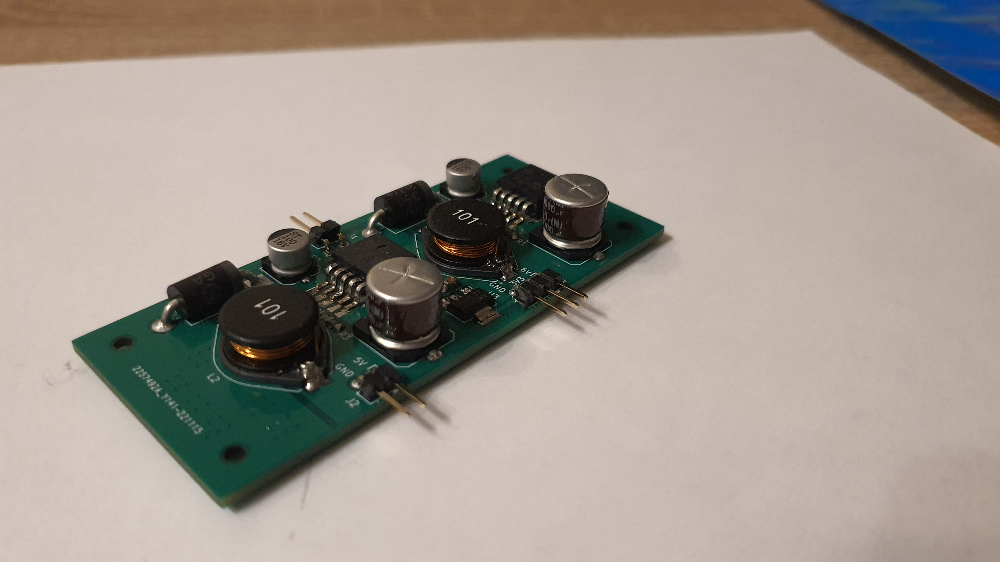
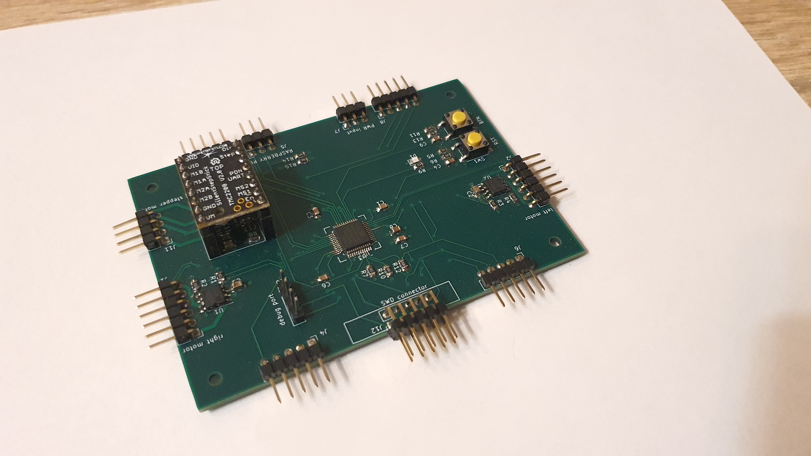

**Beágyazott Linux alapú Modell autó**
===============================================

MSc Önálló laboratórium 2
===============================
*2022.12.13*

**Készítette:** *Koloszár Gergely*

**Konzulens:** *Bányász Gábor*

# Motiváció

A félévi munkámat a tavaji félévben végzett önálló laboratórium munkám alapozta meg. 
Az előző félévben egy linux alapú modell autó megépítését tűztem ki célul, 
amely moduláris kialakításának hála szabadon, igény szerint fejleszthető. 

Fő motivációm ebben a projektben három fő területen történő tapasztalatszerzés és fejlődés. 
- PCB tervezés
- Firmware fejlesztés
- Linux driver programozás

A fenti témakörök mindegyikében rendelkeztem minimális mennyiségű tapasztalattal, de ezek 
elmélyítését evidens, és hasznos fejlődési lehetőségnek tekintettem. 
Erre a legjobb lehetőséget, a fentiek egy projektben történő "egyesítésében" láttam.

# Az előző félév munkája

Az előző félévben sikeresen megalkottam a projekt rendszertervét: 

A fenti topológia négy fő részből áll:

- *Raspberry Pi* : A központi vezérlésért felelős modul, egy beágyazott 
linux disztribúciót futtató eszköz amely a user számára könnyű vezérlési interfészt biztosít.

- *Vezérlő PCB* : A robot alapja, egy STM32 mikrovezérlőn alapuló áramkör, 
amely a Pi irányából érkező utasításokat dekódolja, meghajtja a motorokat és lekérdezi a szenzorok értékét.

- *Táp áramkör* : A raspberry pi, és a vezérlő áramkör számára állít elő `3.3V` illetve `5V` tápfeszültséget,
valamint a motorok számára `6V` feszültséget.

A táp, és a vezérlő áramkörhöz KiCAD segítségével PCB-ket terveztem. 

## A táp áramkör

Az eszköz megtáplálását egy külön áramkör végzi, lévén több különböző feszültségszint előállítására van szükség.
A raspberry pi `5V` tápfeszültséget, és maximum `15W` teljesítményt igényel, a vezérlő 
logika illetve a motorok pedig rendre `3.3V` és `6V` feszültséget igényelnek, összesen pedig szintén 
`15W` teljesítményt. 

A topológiát tekintve a táp két kapcsolóüzemű tápegységből áll, és egy LDO-ból áll.
A két kapcsolóüzemű táp a `12V` bemenetről `6V` és `5V` feszültséget állít elő, a `3.3V` 
feszültséget pedig az LDO állítja elő az `5V` jelszintből.

Az eszköz tényleges feszültésgforrása három 18650-es lítium cella, amelyeket egy BMS modul köt össze,
így biztosítva a `12V` feszültésget és 30W teljesítményt a tápáramkörnek.

## A vezérlő áramkör 

A vezérlésért felelős áramkör egy mikrokontrolleres kapcsolás, amely a szervómotorok meghajtásáért, egy 
léptetőmotor forgatásáért, valamint négy távolságszenzor leolvasásáért felelős. 
A kapcsolás központjában egy `STM32F103C8` típusú mikrokontroller helyezkedik el, amely a fenti feladatok 
végrehajtása mellett interfészt biztosít egy `I2C` porton keresztül a raspberry pi számára valamint debug 
célra egy soros porton keresztül, a fejlesztő számára. 

Az áramkörön található a szervómotorok meghajtásáért felelős IC-pár, amelyek full bridge 
architektúrában teszik lehetővé a motorok PWM jellel történő vezérlését. A PWM jelet 
direkt a mikrokontroller szolgáltatja. 

A PCB négy sarka mellett négy csatlakozót találunk amelyek a mikrokontroller `I2C2` portját kötik össze. 
Ezekre a csatlakozókra kapcsolódnak majd az `I2C` buszon kommunikáló távolságérzékelők, amelyek az eszköz 
biztonságáért felelnek.

Az áramkörön található továbbá egy modul, amely a szervómotor meghajtásáért felelős, és 
`USART` kapcsolaton keresztül lehet vezérelni, valamint programozó csatlakozó a mikrokontroller számára, 
gomb, és LED, amik a fejlesztést megkönnyítik. 

# Összeszerelés

Az idei év első feladata az áramkörök összeszerelése és élesztése volt, amely több kevesebb 
szerencsével sikerült. Apróbb nehézséget jelentett a mikrovezérlő forrasztása a kis méret miatt, valamint, 
a kapcsüzemű tápok forrasztása amelyekre nem készültem fel a tervezéskor, és nem hagytam ki a 
maszkot a thermal padek mögött a kézi forrasztáshoz. 

# Fejlesztői környezet

A fejlesztésben használt eszközök terén egy kevéssé szokványos megoldáshoz folyamodtam, ez pedig egy saját 
fejlesztői környezet összerakását jelenti. A gyártók által készített fejlesztői környezetek gyakran
nehézkesen használhatóak, lassúak, és linux operációs rendszer alá nehezen telepíthetők. A firmware
megalkotásában azonban nincs olyan lépés, ahol a teljes IDE szükségszerű lenne. 

## A szerkesztő
A projektet így egy általam már régebben használt szövegszerkesztő segítségével, az `Emacs`-el valósítottam meg.
Ez a szövegszerkesztő különösen nagy hangsúlyt fektet a személyreszabhatóságra és az ergonómiára így a 
fejlesztést segítő majdnem bármilyen igény kielégíthető. A program teljesen open source, és minden 
nagyobb operációs rendszerre lefordítható, valamint tartozik hozzá több repository, amelyből package-ek
letöltésével személyreszabható az élmény. 

Az `Emacs` egy megfelelő csomag installálása után támogatja az `LSP`, azaz a Language Server Protocolt.
Ez a protocol a Microsoft fejlesztése és egy univerzális szabvány language serverek és 
szövegszerkesztők avagy IDE-k kommunikációjára. Az intelisense funkcionalitás és kódanalízis ezzel a 
csomaggal és egy telepített C language serverrel megoldható. Erre a célra nálam egy Clang futott.

A megelelő fordító kapcsolók ismeretéhez egy utolsó simítás, a `compile_commands.json` file 
generálása hiányzik. Ezt a filet a bear nevű programmal generáltam ami után tökéletesen működött a környezet.

## Fordító
A program fordításához a hivatalos `arm gcc` toolchaint használtam amely legfrissebb verziója elérhető az 
archlinux repositorykból. Ennek a fordítónak a paraméterezése manuálisan bonyolult, és 
repetitív feladat, amely rengeteg hibalehetőséget rejt magában, így a `make` nevű program segítségével
egy Makefileban végeztem a parametrizálást. A makefile hatalmas előnye, hogy könnyen megadhatóak
az elvégezni kívánt funkciók, és könnyű műveletté teszi a fordítást, ha a script már rendelkezésre áll. 

## Build rendszer
A fordításhoz használt Makefile alapjaként az `STM32CubeIDE` környezet által generált makefile szolgált. 
Ennek a filenak az alapján írtam meg a projektben használt scriptet. Később ez a script kibővítésre került 
olyan úgynevezett targetekkel, amelyek pusztán kényelmi szempontok miatt kerültek be.

# A keretrendszer

Beágyazott szoftverfejlesztésben többfajta keretrendszer áll a rendelkezésünkre. Ezek közötti választásnak 
több szempontja lehet. A generált kód mérete, futásideje, a C kód olvashatósága és a fejlesztés sebessége,
mind mind olyan szempont amelyet érdemes figyelembe venni. STM32 mikrovezérlő esetén az ST két 
gyártóspecifikus specifikus keretrendszert biztosít, az ARM pedig egyet. 

## CMSIS 

A CMSIS, azaz Cortex Microcontroller Software Interface Standard, egy az ARM és a chipgyártó által közösen
készített keretrendszer amely a mikrovezérlő regisztereire szolgáltat define-okat, valamint a Cortex mag
kezelésére függvényeket, és adatstruktúrákat. Segítségével az egész mikrovezérlő regiszter szinten elérhető és vezérelhető. 

Hátránya hogy a fejlesztés során a teljes mikrovezérlő pontos ismerete szükséges, hiszen regiszter szinten 
kell konfigurálni minden perifériát és funkciót, ami nem könnyű feladat. Ennek megfelelően a kód megírása 
nagyon sok időt vesz igénybe. 

Egy elkészült kód azonban számos előnnyel is rendelkezik, mint például hogy a CMSIS defineok lényegében 
minimális overheaddel tudnak fordulni. Ez optimális kódméretet tesz lehetővé számunkra valamint rendkívül
gyors futásidőt lévén a kód teljes egészében manuálisan optimalizálható.

A projektben én a CMSIS mellett döntöttem, mert ebben láttam a legtöbb tanulási lehetőséget, valamint 
amennyiben szűkös lenne a memória, ebben a környezetben tudom a legjobban kioptimalizálni a kódméretet.

## LL Driver

Az STMicroelectronics a CMSIS-re építő drivere az LL azaz low-layer, vagy low-level driver. Ez a réteg
nem kifejezetten a direkt felhasználásra készült, leginkább függvényhívásokba rejti a CMSIS kódot,
így téve egyszerűbbé a programozást.

## HAL Driver

A HAL (Hardware Abstraction Layer) driver az ST által ajánlott és leginkább támogatott driver. Komplett HAL 
ökoszisztémára épít amely nagyon kényelmes fejlesztést tesz lehetővé. Ezért cserébe a nagy kódméret, 
és a szuboptimális futásidő az, amit a HAL-ban megírt projektek veszítenek. 

Nagy előnye a HAL drivernek a CMSIS-hez képest, hogy rengeteg dokumentáció, példaprojekt, és segédanyag 
található az interneten. Míg CMSIS fejlesztés közben a legnagyobb segítség a mikrovezérlő reference manual-ja, 
és a nehezen kikereshető példakódok, addig a HAL driver felhasználásához komplett kurzusok 
léteznek az interneten, amelyek teljesen ingyen hozzáférhetőek.

# A multitasking megoldások: FreeRTOS

A projektben használt vezérlésnek több feladattal kell párhuzamosan megbírkóznia:
- szenzorok rendszeres olvasása
- folyamatos kapcsolattartás a vezérlő számítógéppel
- motorok vezérlése

A beágyazott szoftverek esetében több feladat egyszerre történő elvégzése komoly kihívás, amelyre az ipar
több megoldási struktúrát talált ki. Egy projekt megírható saját speciális szabályok betartásával és 
valamilyen szinten alkalmas lesz párhuzamosan végezni több feladatot. Több feladat esetében vagy kellő 
tapasztalat hiányában ez a megoldás azonban nehézkes, és sok hibalehetőséget tartogat.

Szerencsére az ilyen helyzetek megoldására születtek meg a beágyazott operációs rendszerek, amelyekből 
számos különböző fajta közül válogathatunk. Az én választásom a legnépszerűbb ilyen operációs rendszerre, a 
FreeRTOS-ra esett.

Ez az operációs rendszer 32 bites mikrovezérlőkre lett optimalizálva, és teljesen nyílt forráskódú, így a 
projektbe történő integrálása nem ütközött különösebb nehézségbe. További nagy előnye a részletes dokumentáció
amely a FreeRTOS honlapján elérhető.

# Firmware működés

## Driverek megírása a perifériákhoz

A fejlesztés első elemének tekintettem hogy a mikrovezérlő perifériáit teszteljem, és megírjam a 
BSP-t (Board support Package), amelyre aztán a vezérlő logikát alapozhatom. A könnyebb navigáció érdekében a 
projektben használt fileokat külön mappákba szerveztem, és saját nevezéktant vezettem be. Minden forrásfájl az
`src` mappába kerül, és minden header állomány az `inc`-be. a file aláhúzással elválasztva tartalmazza 
a kategóriát, például `driver`, `task`, `IRQ`, valamint a kategórián belüli perifériát vagy funkciót 
amelyet megvalósít, pl.: `usart`, `i2c`.

A megfelelő fájlokban a mikrovezérlő reference manualja alapján implementáltam az inicializáló 
függvényeket, valamint az esetleges olyan hívásokat amikre majd gyakorlatban szükség lehet.

A jelenlegi állapotában a projekt tartalmaz:
- órajel és periféria inicializáló függvényeket, amelyek a rendszer órajelgráfját, illetve perifériáit inicializálják
- egy működő usart interfészt amely alkalmas debug célokra, illetve amely alapján a léptetőmotort vezérlő áramkör már tesztelhető
- egy működő timer funkciót, amely képes PWM jel generálására a motorokhoz
- egy felsetupolt SysTick timert amely a FreeRTOS működéséhez elengedhetetlen
- LED vezérlő függvényeket
- egy félig működő I2C kódot, amely a periféria funkcióinak tesztelésére készült

## Operációs rendszer élesztése

A projekt architektúrájába könnyen integrálható volt a `FreeRTOS` operációs rendszer. A megfelelő port file
kiválasztása után kisebb nehézséget okozott a rendszer-interruptok szintjeinek konfigurálása. Ennek a 
megugrása után, a projektben három taskot hoztam létre hogy az interruptok kezelését valamint az 
ütemező működését tesztelhessem. A projekt jelenleg nem tartalmaz teljesen funkcionális taskot, a
kommunikációra készült taskot leszámítva. Ezutóbbi részben felel a debug interfész biztosításáért.

A további task implementációk sajnos az `I2C` driver hiányában nem valósultak meg.

## Taskok megírása

A projekt következő lépése, hogy a már megírt BSP réteg, és interrupt handler függvények segítségével 
implementáljam mindhárom (kommunikáció, sensor, motor) taskokat, valamint megírjam a vezérlésükzöz használt 
protokolt amelyel a raspberry pi vezérelheti az áramkört.

# Fejlesztési lehetőségek

A projekt elsődleges fejlesztési lehetősége a jelenlegi funkcionalitás befejezése:
- mechanikai váz megalkotása
- tápáramkör bemérése
- firmware véglegesítése
- linux driver megírása
- felhasználói applikáció, amely a viselkedésért felel.

A befejezett már működő eszközbe tervezve van egy kamera, ennek a kamerának a megvalósítása, a forgatás
megvalósítása a firmwareben, illetve egy videostreaming megvalósítása a raspberry pi-n evidens és tanulságos
fejlesztési lehetőség.

# Repositoryk

1. A projekt teljes egészében verziókövetve van és saját repositoryval rendelkezik: [link](https://github.com/GaryBlackbourne/raspberry-robot)
2. A CMSIS fejelesztésben használt projekt architektúra és scriptek szintén elérhetőek githubon: [link](https://github.com/GaryBlackbourne/arm-dev-template)

# Források

1. mikrokontroller dokumentáció: [link](https://www.st.com/en/microcontrollers-microprocessors/stm32f103c8.html)
2. FreeRTOS honlap, dokumentáció: [link](https://www.freertos.org/)
3. Emacs honlap: [link](https://www.gnu.org/software/emacs/)
4. ARM GNU toolchain: [link](https://developer.arm.com/Tools%20and%20Software/GNU%20Toolchain)
5. Hasznos tutorialok amiből sokat tanultam a firmware megírásához: [link](https://controllerstech.com/stm32-registers/)
