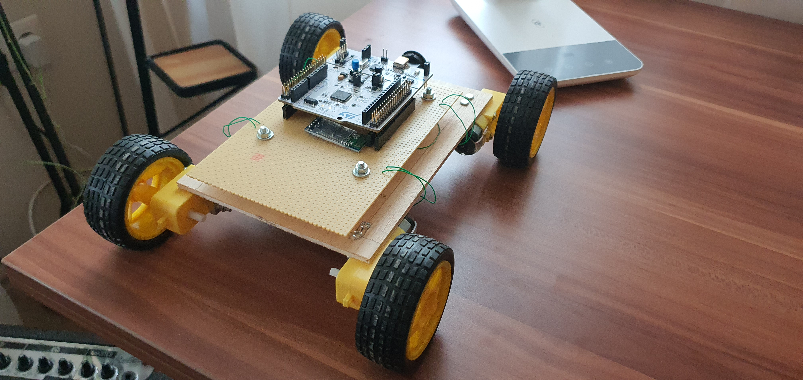
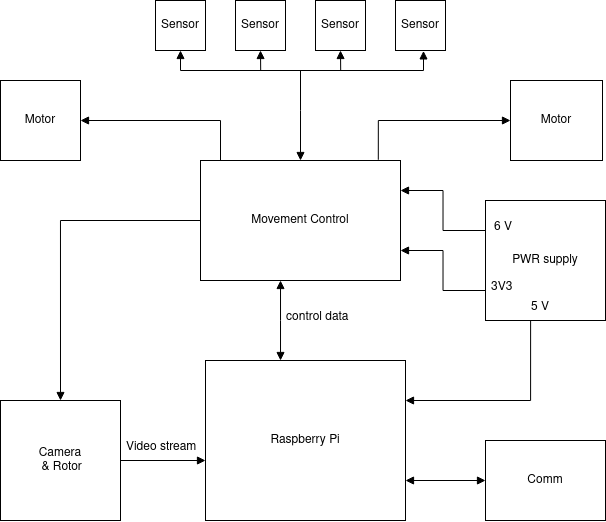
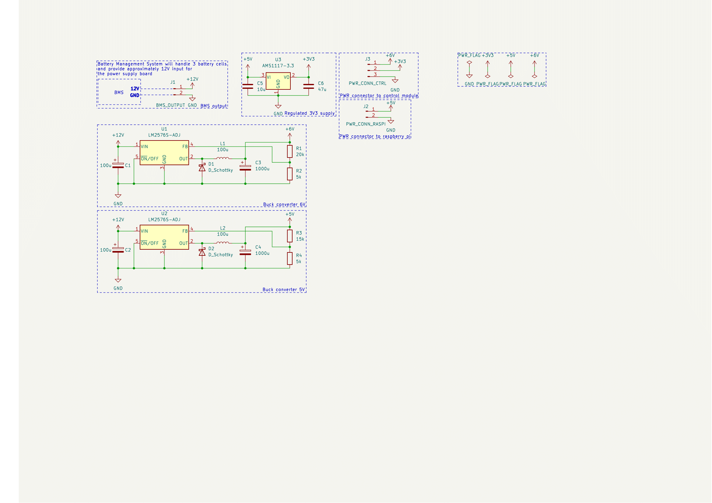
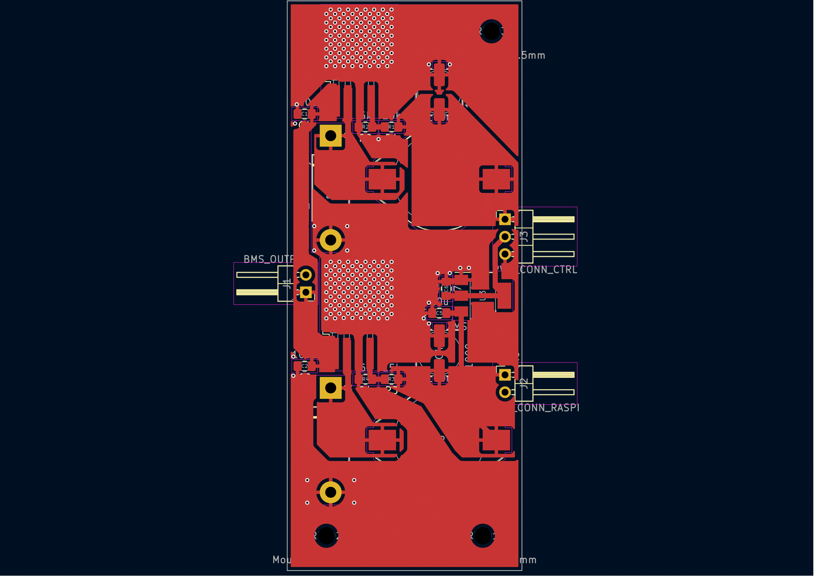
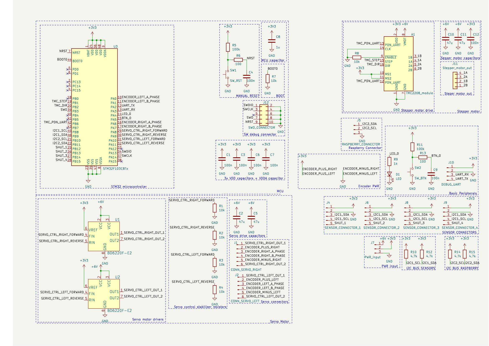
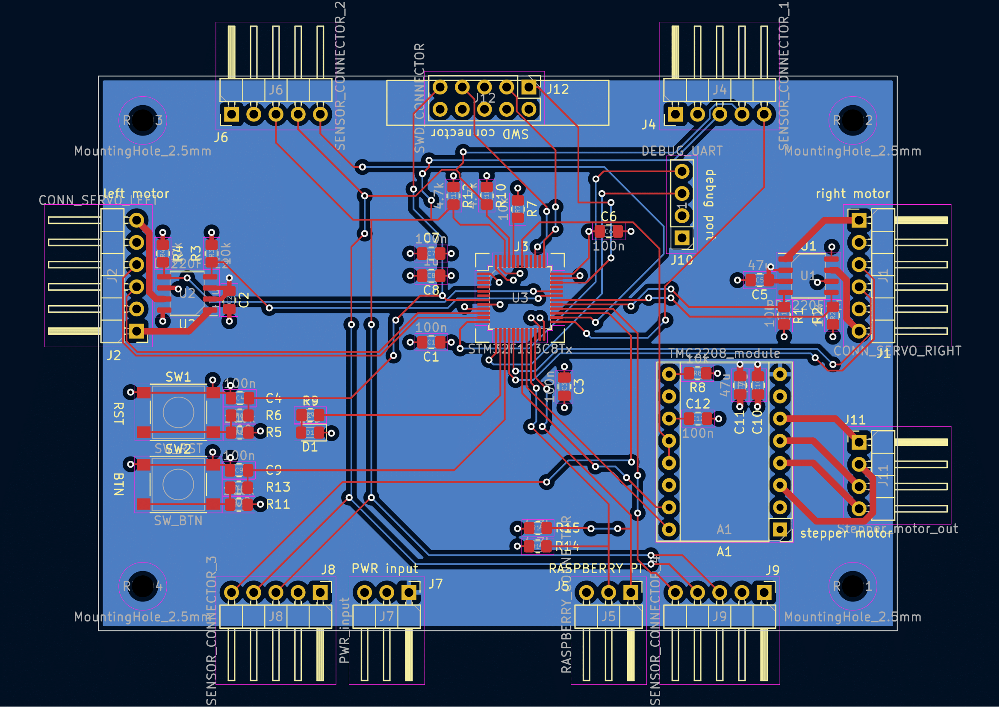

***Beágyazott Linux alapú modell autó***
========================================

MSc önálló laboratórium 1
=========================
*2022.05.25*

**Készítette:** *Koloszár Gergely*

**Konzulens:** *Bányász Gábor*

# Motiváció

A félév során végzett önálló laboratórium feladatom egy hosszabb, több féléven átívelő projekt első fázisa. A projekt legfontosabb célja a tapasztalat- illetve a gyakorlatszerzés. A specifikáció megfogalmazása során szem előtt tartottam három fontos területet, amiben tanulni illetve fejlődni szerettem volna:

  - PCB tervezés
  - Firmware fejlesztés
  - Beágyazott Linux

A fenti témakörök mindegyikében rendelkeztem minimális mennyiségű tapasztalattal, de ezek elmélyítését evidens, és hasznos fejlődési lehetőségnek tekintettem. Erre a legjobb lehetőséget, a fentiek egy projektben történő "egyesítésében" láttam.

Az önlabor témáját tekintve egy régi projektem továbbgondolt, és újratervezett verziójának megvalósítása mellett döntöttem. Ez a régi projekt egy `nucleo-64` alapú kisautó modellje amelyet egy szabadon választható tárgy kereteiben készítettem. Ez a projekt egy egyszerű modell autó, amely bluetooth-on keresztül vezérehető egy androidos segédapplikáció segítségével. A projekt [github repositoryból](https://github.com/GaryBlackbourne/ARMobile) elérhető, ahová, a megfelelő forrásfájlok, tervek, és dokumentáció is feltöltésre került.

A projektben további célom volt, hogy egy hosszabb, több lépcsős feladatot tudjak véghezvinni, ahol a különböző fázisok megtervezése, segíti a fejlesztés menetét. A projekt volumene pedig teret enged nagyobb komplexitású feladatoknak is, amelyek kidolgozása során esetleges újabb ötletek kerülhetnek a tervezőasztalra, ezáltal téve sokszínűbbé a feladatot.

# Specifikáció

A továbbiakban a projekt specifikációját szeretném ismertetni.

## Modularitás

A modell tervezése során az egyik legfontosabb tényezőnek a modularitást tartottam. A teljes modell kis, könnyen (illetve könnyebben) tervezhető és építhető modulokból terveztem összerakni. Ennek számos előnye van:

  - Nem szükséges mindenből azonnal a legjobat létrehozni, hiszen később amennyiben jobb minőségű modul megalkotására leszek képes, úgy ezt könnyen eszközölhetem mint fejlesztés, nem szükséges mindent cserélni.
  - Minél több modulból áll egy rendszer, annál könnyebb javítani, hiszen elég csak a meghibásodott modult kicserélni egy működőre
  - A tesztelési fázisban minden modult külön lebonthatunk, így viszonylag könnyen meg lehet keresni egy hiba forrását, és lokalizálni a problémát
  - A fejlesztési fázist több, egymással párhuzamosan végezhető feladatra tudom bontani, így megkönnyítve az idővel való gazdálkodást

## Feladatok

A projektet több generáción keresztül szeretném fejleszteni, itt csak az első generáció specifikációjára szeretnék kitérni.

Ebben a generációan A legalapvetőbb működésekre szorítkoztam, és két extra funkcionalitást terveztem.

### mozgás
Az alapvető működés, a mozgás képessége, amelyet két - oldalanként egy egy - motor tesz lehetővé. A kialakításban a 2+1 kerekes konstrukciónál maradtam, mert a mozgás vezérlését a bevezetőben említett projektben tapasztaltam, és a kétmotoros konstrukcó ebben a méretben praktikusabbnak tűnt.

A motorok vezérlését külön panel látja el, amelyen egy mikrovezérlő gondoskodik a megfelelő motorvezérlésről.

### védelem
Minden mozgó eszköz - megfelelő elővigyázatosság hiányában - magában hordozza a sérülés lehetőségét, gondolhatunk olyan egyszerű dolgokra is minthogy nekimegy a falnak. Ezt hivatott a négy darab lézeres távolságmérő megoldani, amelyeket direkt, a motorokat vezérlő mikrokontroller kezel.

### irányítás
A mozgás vezérlését, és az irányítást, a továbbfejleszthetőség és a logikusan moduláris megközelítés miatt szétválassztottam, ezutóbbira egy SBC-t (Single Board Computer) választottam, amely képes magasabb szintű absztrakció megvalósítására.

### tápellátás
A felsorolt elemeknek mind szükségük van tápfeszültségre, amelyet mobilis eszköz révén, praktikusan akkumulátorokból nyernek. Ezeknek a celláknak a megfelelő kezelése, illetve a szükséges feszültségszintek előállítása egy külön modul feladata.

### kommunikáció (*extra*)
A tervezés idején nyitott kérdésként szerettem volna hagyni, hogy önjáró, vagy távirányítható konstrukciót készítsek, viszont minden esetben hasznosnak ítéltem egy nagyobb távolságú kommunikációs modult, amely segítségével az eszköz hatósugara minél inkább növelhető.

### kamera (*extra*)
Az első generációban egy periszkóp jelleggel forgatható kamerát terveztem a modellre, amely így egy host számítógép irányába továbbíthat egy videostreamet, ezzel könnyítve a kezelést, vagy csak szórakoztatóbbá téve a használatot.

## Blokkvázlat.

A projekt tervezésének szakaszában egy blokkdiagrammot készítettem, amelyben a fenti funkciókat összefoglaltam:

# Eszközválasztás

A projektben a számomra leginkább ismert, és ergonomikus rendszereket, eszközöket szerettem volna használni, ezekről ejtenék egy pár szót.

A fejlesztés teljes menetét `Linux` operációs rendszeren végeztem, mert az általam használt disztribúciót ítéltem a legkényelmesebb megoldásnak a fejlesztés workflowját tekintve.

Erre az operációs rendszerre sajnos nem lehet Altiumot telepíteni és workaroundot sem találtam, ezért az áramkör tervezését egy népszerű open source alternatívával, a `KiCAD` nevű programmal végeztem el.

Az eszköz irányítását egy `Raspberry Pi 4` SBC felhasználásával terveztem, mert ez volt a legmegfelelőbb eszköz, amely a rendelkezésemre állt.

A motorok és a szenzor vezérlését `STM32F103C6T8` mikrokontroller felhasználásával terveztem. Ennek a családnak ARM Cortex M3 magja van, amely bőségesen elegendő a megvalósítandó feladatra, valamint 48 pines tokozásban elég láb is áll rendelkezésre. Nem utolsó sorban STM32 mikrokontrollerre történő fejlesztésben rendelkezem némi gyakorlattal, és relatíve könnyen használható fejlesztői környezet létezik hozzá amit Linuxra telepíteni tudtam.

A kommunikációs modul sajnos nem került külön megvalósításra, így a Raspberry beépített WiFi modulját használom.

A motor választásában egy `N20E` motor mellett döntöttem, amely 6V feszültségről üzemel, ezt könnyen előállíthatónka tartottam, valamint a teljes modell tömegéhez viszonyítva megfelelő mértékű nyomaték kifejtésére alkalmas.

A szenzorokat modul formában szereztem be, ez a forma megkönnyíti a megfelelő orientációt, valamint a chiphez használt kiegészítő elektronika is a modulra van tervezve. A választásom egy tapasztaltabb kolléga tanácsára a `VL53L1` modellre esett, amely egy azonos nevű chipet hordoz.

A tápáramkör két fő PCB-ből áll. Elsőként egy `BMS` modulból, amely a 12V tápfeszültséget előállítja három darab 18650-es LiIon cellából, valamint ezeket a cellákat kezeli is. Ezt a 12V feszültséget felhasználva egy általam tervezett modul két kapcsolóüzemű táp, illetve egy Voltage regulator segítségével állítja elő a megfelelő feszültségszinteket. A táp tervezésénél figyelembe vettem, hogy a raspberry 15W teljesítményt, a motorok illetve a motor vezérlő elektronika körülbelül szintén 15W-ot fogyasztanak, legnagyobb kihasználtság esetén. A táp ezért ezeket a kritériumokat felülről teljesíti, hogy a konfiguráció képes legyen az előforduló legnagyobb tartományban működni.

Az eőállított feszültségszintek:
  - **6V**:     a motoroknak
  - **5V**:     a Raspberry Pi számára
  - **3.3V**:   a motorvezérlő elektronika számára

Sajnos a kamera nem került megvalósításra időhiány miatt, így amennyiben túllépi a táp által meghatározott teljesítménykorlátot, úgy új táp modulra lesz szükség.

A kamera forgatását léptető motorral terveztem megoldani, amit egy `17HS40` léptetőmotorral képzeltem el. A motor mérete és tömege viszont érthetetlen okokból elkerülte a figyelmemet, így ez komplikációkat okozhat a későbbiekben, elképzelhető hogy az adott alkatrészt cserélni kell.

# PCB tervek

A fenti specifikációknak megfelelően két PCB terv készült, amelynek a sematikus ábráit, illetve a layoutokat itt mutatnám be. A layoutokról eltávolítottam néhány layert, amelyeknek funkcionális szerepük a megértésben illetve a demonstrálásban nincs, ezeket a teljes KiCAD projekt terménszetesen tartalmazza.

## A táp modul

### A táp schematic
A schematicban látható kapcsolás a használt IC adatlapjából vett referencia kapcsolás. A buck konverter alkalmazását a viszonylag nagy hatásfok miatt éreztem szükségesnek, hiszen így az autó sokkal tovább marad használható töltés nélkül.

Az 5V és a 6V tápveszültség buck konverterrel áll elő, a 3.3V-ot viszont az egyszerűség kedvéért egy egyszerű LDO szolgáltatja, az előzőleg már előállított 5V-ból.

### A táp layout
A Layout tervezése különösen nagy kihívást okozott, lévén ez az első általam tervezett kapcsolóüzemű táp. Előzetes ismereteim alapján igyekeztem a lehetó legkörültekintőbben elhelyezni az alkatrészeket, az összekötéshez pedig kitöltéses mezőket használtam, hogy a nagyfrekvenciás zavarás minél kevésbé jelenjen meg a kimeneten. A kapcsüzemet megvalósító IC-k alá hőelvezető viákat helyeztem, hogy a fentiek hűtése minél inkább biztosítva legyen.

A tervezés során a csatlakozókat 2.54 mm standard pinsornak választottam, mert az ezekhez való kapcsolódás okozza a legkisebb nehézséget. A PCB-n helyet kapott ezen felül három szerelési furat, amely az elkészült modult hivatott az autó vázához rögzíteni.

## A vezérlő panel

### A vezérlő schematic
A vezérlő egység sematikus ábrája jóval zsúfoltabbra sikeredett, köszönhetően a nagyságrendekkel nagyobb funkcionalitásnak ami az adott felületre sűrűsödött. A bal felső sarokban a mikrovezérlő ábráját láthatjuk amelyet labelek segítségével kapcsoltam a többi funkcionális blokkhoz.

A bal alsó sarokban találhatjuk a szervómotorok vezérlésére használt hidakat, illetve csatlakozóikat. Ezek a motorok képesek encoder segítségével visszajelzést adni a sebességükről, ehhez 3.3V encoder feszültséget választottam, a motor adatlapja alapján.

A jobb felső sarokban kapott helyet a szervó motor vezérlésére használt modul, és a hozzá tartozó kiegészítő elektronika.

A board tartalmaz továbbá két gombot, egy RST és egy felhasználói gomb funkcióval, valamint egy ledet. Ezekre az áramkör élesztésénél, valamint a firmware fejlesztésénél lehet szükség.

A kommunikáció a board és a Raspberry között, valamint a board és a szenzorok között I2C platformon működik, amelyhez a mikrovezérlőben található mindkét I2C periféria felhasználásra került.

### A vezérlő layout
A layout tervezésénél igyekeztem minél inkább egy helyre pakolni az adott funkcióval bíró alkatrészcsoportokat. A csatlakozók kialakításánál igyekeztem figyelembe venni, hogy minden eszköz lehetőleg rendezetten tudjon majd a kész rendszerhez kapcsolódni.

# fejlesztési lehetőségek

A projekt számtalan fejlesztési és javítási lehetőséget hordoz, ezekből párat foglalnék össze.

## Javítások:

Mindenképpen eszközölendő javítás, a léptetőmotor méretének és volumenének feloldása. Jelen helyzetben elképzelhető, hogy az eszköz veszít a funkcionalitásából, a túl nehéz motor választása miatt.

## Fejlesztések:

Elsőként az akkumulátorok kezelését emelném ki. A táp áramkör a jelen projektnek megfelelő, viszont mindenképpen szükség lenne egy kényelmesen használható töltésvezérlésre, hogy az eszközt ne kelljen megbontani és a kivett cellákat külső eszköz segítségével feltölteni. Ennek az implementálására leginkább egy saját USB csatlakozóval ellátott töltést szeretnék készíteni, hiszen ez a csatlakozó mindenkinek a rendelkezésére áll.

A töltés vezérlése mellett egy monitorozó eszköz is hasznos fejlesztés lenne, amely a központi egységet, az akkumulátor töltöttségi adataival látja el, így megelőzve, hogy a rendszer túlmerüljön.

Alkalmas Újítás lenne egy kapcsoló amely a rendszert áramtalanítani tudja, hogy a tárolás ilymódon könnyebbé váljon.

Érdekes fejlesztés lenne a projekt későbbi szakaszában egy dedikált kommunikációs modul megalkotása, amely megnövelné a hatósugarát az eszköznek. Habár ez a funkció az első generáció specifikációjában benne volt, sajnos nem jutott rá elég idő és energia.

Végül, de nem utolsó sorban egy gyorsulásmérő elhelyezése praktikus fejlesztés lenne egy ilyen alkalmazásban.

# Repository

A projekt teljes egészében verziókövetve van és saját repositoryval rendelkezik, [ezen](https://github.com/GaryBlackbourne/raspberry-robot) a linken.
